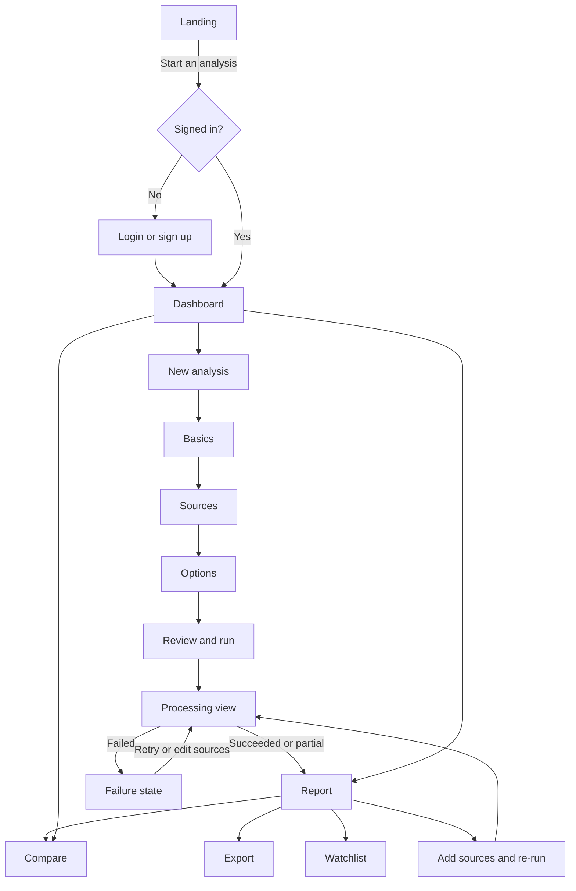
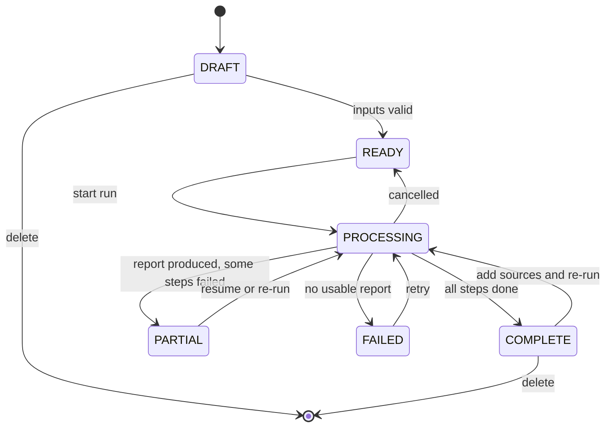
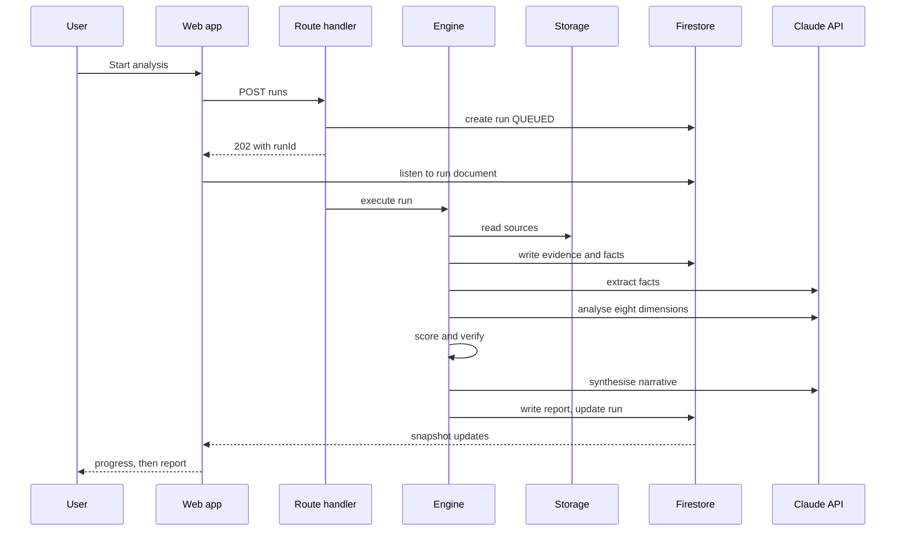

# ARGUS AI — App Flow

| | |
|---|---|
| Version | 0.1 |
| Date | 2026-09-21 |
| Read with | [PRD](PRD.md), [DESIGN](DESIGN.md), [SCHEMA](SCHEMA.md) |

This document defines routes, screens, journeys, states and edge cases. Visual details live in DESIGN; data shapes in SCHEMA.

---

## 1. Primary journey



## 2. Analysis lifecycle



## 3. Run sequence



## 4. Route map

| Route | Screen | Access | Notes |
|---|---|---|---|
| `/` | Landing | Public | Hero with annotated sample; CTA to start or view sample |
| `/sample` | Sample report | Public | Fictional demo report, labelled |
| `/login`, `/signup` | Authentication | Public | Redirect to `/app` when signed in |
| `/app` | Dashboard | Auth | Command centre |
| `/app/analyses` | Analyses list | Auth | Search, filter, sort |
| `/app/analyses/new` | Create draft | Auth | Creates a `DRAFT` and redirects to setup |
| `/app/analyses/[id]/setup` | Setup wizard | Auth, owner | `?step=basics\|sources\|options\|review` |
| `/app/analyses/[id]` | Report, or processing, or setup redirect | Auth, owner | View depends on status. Deep link: `?section=traction&claim=clm_...` |
| `/app/compare` | Comparisons list and creator | Auth | |
| `/app/compare/[id]` | Comparison view | Auth, owner | |
| `/app/watchlist` | Watchlist and signals | Auth | Signals arrive in Phase 6 |
| `/app/settings` | Account, usage | Auth | |
| `/app/settings/methodology` | Scoring methodology | Auth | Read-only weights and rubrics |
| `/print/report/[id]` | Print-optimised report | Auth, owner | For browser "Save as PDF" |
| `/legal/terms`, `/legal/privacy`, `/legal/disclaimer` | Legal pages | Public | Phase 6 |
| `/dev/ui`, `/dev/runs/[id]` | Component gallery, run inspector | Dev only | Not built in production |

## 5. Screen specifications

### 5.1 Landing (`/`) — FR-LND-01..03

- Purpose: convince a professional visitor in under a minute that ARGUS is evidence-first and different from a chat summary.
- Structure: hero with an annotated sample claim and evidence rail; the four statuses explained; how it works (a real sequence); report tour; comparison preview; what ARGUS will not do; final call to action; footer with disclaimer.
- Actions: "Start an analysis" (to `/signup`), "See a sample report" (to `/sample`).
- States: fully static; no loading state needed.

### 5.2 Dashboard (`/app`) — FR-DSH-01..09

- Modules: KPI strip; analyses table (top 10 with link to all); in-progress runs with step progress; watchlist; recent activity; derived market intelligence panel.
- Actions: New analysis (primary), open analysis, toggle watchlist, compare selected.
- Empty (no analyses): guided first-run panel with the New analysis action and a link to the sample report.
- Loading: skeleton rows and KPI placeholders sized to final layout.
- Error: inline panel with the failed module name and Retry; the rest of the page stays usable.

### 5.3 Setup wizard (`/app/analyses/[id]/setup`) — FR-INT-01..06

| Step | Fields and controls | Validation |
|---|---|---|
| 1. Basics | Startup name (required), website, one-line description, stage, sector, HQ country | Name required; website must be a valid URL |
| 2. Sources | Drop zone for files; add URL; paste text; per-source type selector (auto-suggested); status chip per source | At least one source or a website URL. File checks per TRD section 9. |
| 3. Options | Public web research toggle (default on, with a plain explanation), stage profile (defaults from stage), optional analyst focus note | Focus note is length-limited and cannot override evidence rules |
| 4. Review and run | Summary of inputs, what will be sent to the model provider, expected duration, disclaimer | Run disabled until valid |

- Progress is saved on every step (draft). Leaving and returning resumes at the last completed step.
- Uploads go directly to storage with a progress bar; the server then validates and registers each file.
- The sources step shows a quality hint ("A pitch deck plus a website gives the strongest first report") and never blocks on optional inputs.

### 5.4 Processing view (`/app/analyses/[id]` while `PROCESSING`) — FR-ENG-09..10

- Vertical step list: Read sources, Extract facts, Research the web (if enabled), Check consistency, Analyse dimensions (with eight sub-rows), Score, Write summary, Verify, Finish.
- Live counters: sources read, evidence items, facts found, claims verified, claims downgraded.
- Partial results appear as they land (for example the extracted facts list after step 2).
- Actions: Cancel run. A note states the run continues if the user leaves the page.
- Completion: automatic transition to the report with a brief "Report ready" toast.
- Failure: shows which step failed, the error in plain words, completed work retained, and Retry from this step / Edit sources.

### 5.5 Report (`/app/analyses/[id]` when `COMPLETE` or `PARTIAL`) — FR-RPT-01..23

```
┌ Header: name, stage, sector, version, generated time · Compare · Export · Watch · Re-run ┐
├─────────────┬───────────────────────────────────────────────┬──────────────────────────┤
│ Section nav │ Reading column (max ~68ch prose)              │ Evidence rail            │
│ (sticky)    │  Section header + evidence bar                │  Default: composition,   │
│ 16 sections │  Claims with status markers                   │  top missing items       │
│ grouped     │  Section-specific charts and tables           │  On claim select: quotes,│
│             │                                               │  source, reliability     │
└─────────────┴───────────────────────────────────────────────┴──────────────────────────┘
```

- Status filter above the column: All, Sourced, AI analysis, Assumptions, Missing (FR-RPT-23).
- A claim opens the evidence rail; on narrow screens it opens as a bottom sheet.
- The Investment Score section includes the score, confidence, dimension radar, and the "Explain the score" panel.
- `PARTIAL` reports show a banner listing failed steps and a Resume action; affected sections display "Not analysed".
- Version selector switches reports; older versions are read-only and marked as such.

### 5.6 Compare (`/app/compare`, `/app/compare/[id]`) — FR-CMP-01..06

- Creator: choose 2 to 4 completed analyses (latest report by default, or pick a version).
- View: header per startup with score and confidence; radar overlay; dimension table with deltas; canonical-metric matrix with explicit "Not available" cells; risk and flag counts; optional narrative (P2).
- Warnings when stage profiles or scoring versions differ; scores are not silently rescaled.

### 5.7 Watchlist (`/app/watchlist`) — FR-WCH-01..03

- Table of watchlisted analyses with score, last report date and open flags. From Phase 6 a signal feed with impact tags and a Re-run suggestion.

### 5.8 Settings — FR-SET-01..04, FR-AUT-03

- Account, usage and limits, scoring methodology (read-only), data controls (delete account and export data arrive in Phase 6).

## 6. State catalogue

| Surface | Loading | Empty | Error | Partial |
|---|---|---|---|---|
| Dashboard modules | Skeletons at final size | First-run guidance or module-specific hint | Inline error with Retry, other modules unaffected | Not applicable |
| Analyses list | Skeleton rows | "No analyses match these filters" with Clear filters | Inline error with Retry | Not applicable |
| Wizard sources | Per-file progress | Instruction and accepted types | Per-file error with fix guidance | Some files failed: run allowed if at least one source is usable |
| Report | Section skeletons stream in | Not applicable | Full-page error with Retry | Banner plus "Not analysed" sections |
| Evidence rail | Skeleton | Composition summary | "Could not load this source" with Retry | Not applicable |
| Compare | Skeleton | Prompt to select analyses | Inline error | Missing metrics shown as Not available |

## 7. Microcopy (voice: plain, specific, sentence case; errors do not apologise)

| Situation | Copy |
|---|---|
| Empty dashboard | "No analyses yet. Add a pitch deck or a website to start your first one." |
| Primary action | "New analysis" |
| Run start | "Start analysis" |
| Scanned PDF fallback | "This PDF has no text layer. ARGUS will read it visually, which takes longer and may miss small text." |
| Unreadable file | "This file could not be read. It may be password-protected or damaged. Upload an unlocked copy." |
| Insufficient evidence | "Not enough evidence to score this analysis. Add financials or traction data to unlock a score." |
| Missing claim | "Not in the sources provided." |
| Partial report | "This report is partial. Traction could not be analysed. Resume to retry that step." |
| Delete confirm | "Delete this analysis? Its files, evidence and reports will be removed permanently." |
| Disclaimer (short) | "Research tool only. Not investment advice." |

## 8. Edge cases

| Case | Behaviour |
|---|---|
| Duplicate startup name | Allowed; list shows created date and website to disambiguate |
| Scanned or image-only deck | Vision fallback per page; evidence marked `vision`; user informed |
| Website unreachable or blocked | Source marked failed with reason; run continues on other sources |
| Only a website URL provided | Allowed; report shows low confidence and many Missing items |
| Web research returns nothing relevant | Section states no independent sources were found; no filler |
| Conflicting numbers across sources | Both facts kept, a flag is raised, report cites both |
| Non-English documents | Extracted as-is; quotes kept in the original language; claims written in English with the quote unchanged |
| Very large deck or over limits | Rejected before run with the limit stated |
| Run fails midway | Completed steps kept; Resume from failed step |
| User cancels | Run marked cancelled; analysis returns to `READY`; partial artefacts kept but no report created |
| Analysis deleted while referenced by a comparison | Comparison keeps a snapshot label for that item marked "Deleted"; if fewer than 2 items remain the comparison is removed |
| Comparing different scoring versions | Warning banner; scores shown as generated |
| Session expires mid-wizard | Draft is saved; user signs in and resumes |
| Browser offline | Actions that need the server are disabled with a clear notice |

## 9. Keyboard shortcuts

| Keys | Action | Context |
|---|---|---|
| Cmd/Ctrl + K | Open command palette | Everywhere in app |
| N | New analysis | App, when no input is focused |
| / | Focus search | Lists |
| J / K | Next or previous section | Report |
| E | Toggle evidence rail | Report |
| Esc | Close drawer, sheet or palette | Overlays |

## 10. Navigation structure

- Sidebar (desktop): Dashboard, Analyses, Compare, Watchlist, Settings. Collapsible.
- Mobile: bottom bar with Dashboard, Analyses, New (centre action), Compare, More.
- Breadcrumbs inside analyses: Analyses / Startup name / Section.
- Deep links to a claim (`?claim=`) open the evidence rail on load.
