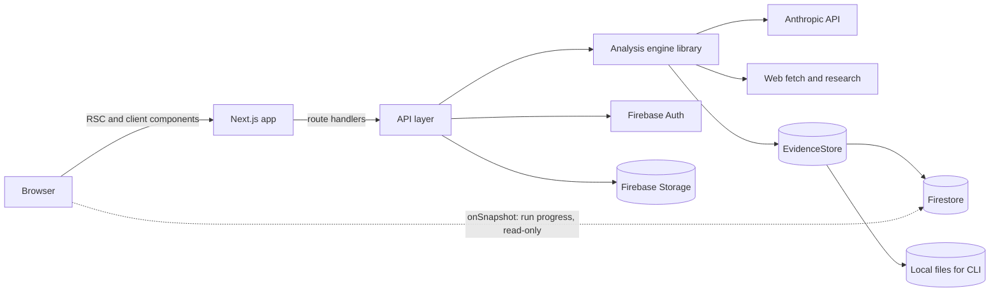

# ARGUS AI — Technical Requirements Document (TRD)

| | |
|---|---|
| Version | 0.1 |
| Date | 2026-09-21 |
| Read with | [PRD](PRD.md), [SCHEMA](SCHEMA.md), [AI_SPEC](AI_SPEC.md), [RULES](RULES.md) |

Version policy: use the latest stable release of each dependency at scaffold time, pin exact versions in `package.json`, and record them in [PROJECT_MEMORY](PROJECT_MEMORY.md). Do not rely on remembered API shapes; check the installed package types or docs.

---

## 1. Architecture overview



Key architectural decisions:

1. **The engine is a UI-independent library** (`src/lib/analysis`). It runs from the CLI (`pnpm analyze`) and from the app. It must not import from `next/*`, `src/components`, or `src/app`.
2. **Storage is behind an `EvidenceStore` interface.** Two implementations: `FileStore` (CLI, evals, tests) and `FirestoreStore` (app).
3. **Pipelines are step machines.** Each step is idempotent and persists its output, so runs are resumable and partial results are safe.
4. **Trust is enforced in code.** The model proposes; validators decide (see AI_SPEC).
5. **Firestore is read-only for clients.** All writes go through route handlers using the Admin SDK. Clients only listen to run progress.
6. **Progress is delivered by Firestore listeners** on the run document, not by holding an HTTP stream open.

## 2. Stack

| Layer | Choice | Notes |
|---|---|---|
| Framework | Next.js App Router, React, TypeScript (strict) | Server components for data-heavy pages; route handlers for API |
| Package manager | pnpm | |
| Styling | Tailwind CSS with CSS-variable tokens | Tokens in `src/styles/tokens.css` (see DESIGN) |
| UI primitives | shadcn/ui (Radix) where native platform features fall short | Prefer native `dialog` and Popover where feasible |
| Charts | Recharts for line and bar; custom SVG for gauge, radar, evidence bar | |
| Tables | TanStack Table | |
| Forms | react-hook-form with Zod resolver | |
| Client data | TanStack Query for mutations and client fetching | Initial data comes from server components |
| Motion | CSS first; View Transitions as progressive enhancement | Add a motion library only if CSS cannot do it |
| Auth | Firebase Auth (Google, email) with server session cookies | |
| Database | Firestore (Admin SDK on the server) | |
| Files | Firebase Storage | |
| LLM | Anthropic API through the official TypeScript SDK | Model IDs come from env, never hard-coded |
| PDF text | Per-page extraction library chosen in T-2.03; vision fallback via Claude for scanned files | Locators need page numbers |
| Office and data files | DOCX reader (for example `mammoth`), CSV parser (`papaparse`), a maintained XLSX reader (evaluate `exceljs`) | Cap decompressed size |
| HTML extraction | Readability-style extractor on a server DOM | |
| Validation | Zod | Schemas are the source of truth for types |
| Logging | pino with redaction | |
| Testing | Vitest, Testing Library, MSW, Playwright, Firebase emulators | |
| Lint and format | ESLint, Prettier | |
| CI | GitHub Actions | |
| Hosting | Firebase App Hosting or Vercel | Decide by Phase 3 (OQ-7). Pipeline must not depend on either. |

## 3. Hosting and long-running work

A run takes roughly 1 to 5 minutes. Serverless timeouts and post-response CPU throttling are the risk.

| Mode | Description | Use |
|---|---|---|
| A. Inline | `POST /runs` creates the run and the handler keeps executing the pipeline to completion. UI follows the run document. The handler must ignore client disconnects. | Local dev and first deploy. Verify platform max duration and that CPU stays allocated until the handler finishes. |
| B. Queued | Handler enqueues a job (Cloud Tasks, or a durable-step service such as Inngest) that calls a step endpoint. | Production hardening, Phase 6 (T-6.03). |

Both modes call the same `runPipeline(ctx)` function. Choosing between them is a deployment concern only. Record the decision in PROJECT_MEMORY.

## 4. Repository structure

```
argus-ai/
├─ CLAUDE.md
├─ README.md
├─ .env.example
├─ docs/                     PRD, TRD, APP_FLOW, SCHEMA, DESIGN, AI_SPEC,
│                            IMPLEMENTATION_PLAN, TRACKER, RULES, PROJECT_MEMORY
├─ evals/
│  ├─ fixtures/<slug>/       fictional startups: sources + expected.json
│  ├─ run.ts
│  └─ thresholds.json
├─ firebase/                 firestore.rules, storage.rules, firestore.indexes.json
├─ scripts/                  CLI entry points (analyze.ts)
├─ src/
│  ├─ app/
│  │  ├─ (marketing)/        landing, sample, legal
│  │  ├─ (auth)/             login, signup
│  │  ├─ (app)/app/          shell layout, dashboard, analyses, compare, watchlist, settings
│  │  ├─ print/report/[id]/  print-optimised report
│  │  ├─ dev/                dev-only: ui gallery, run inspector
│  │  └─ api/                route handlers
│  ├─ components/
│  │  ├─ ui/                 primitives
│  │  ├─ argus/              domain components (StatusBadge, EvidenceBar, ClaimRow, ...)
│  │  ├─ charts/             ScoreGauge, DimensionRadar, Sparkline, ...
│  │  ├─ layout/             AppShell, nav, command palette
│  │  └─ marketing/
│  ├─ lib/
│  │  ├─ analysis/           engine: pipeline/, steps/, ingest/, research/, scoring/, verify/, prompts/, store/
│  │  ├─ ai/                 Anthropic client wrapper, model roles, structured output, usage
│  │  ├─ schema/             Zod schemas and inferred types
│  │  ├─ repos/              Firestore repositories (server only)
│  │  ├─ firebase/           client.ts, admin.ts
│  │  ├─ api/                route helpers: auth guard, errors, validation
│  │  ├─ env.ts, logger.ts, format.ts
│  ├─ hooks/
│  ├─ demo/                  fictional demo dataset typed as Report
│  └─ styles/                tokens.css, globals.css
└─ tests/                    unit, integration, e2e
```

## 5. Analysis engine

### 5.1 Interfaces (shapes, not final signatures)

```ts
interface EvidenceStore {
  putSources(analysisId: string, sources: Source[]): Promise<void>;
  putEvidence(analysisId: string, items: Evidence[]): Promise<void>;
  listEvidence(analysisId: string): Promise<Evidence[]>;
  putFacts(analysisId: string, facts: Fact[]): Promise<void>;
  listFacts(analysisId: string): Promise<Fact[]>;
  saveDimension(analysisId: string, reportId: string, d: DimensionAnalysis): Promise<void>;
  saveReport(analysisId: string, report: Report): Promise<void>;
  updateRun(analysisId: string, runId: string, patch: Partial<Run>): Promise<void>;
}

interface LLM {
  structured<T>(args: {
    role: "ANALYSIS" | "SYNTHESIS" | "FAST";
    system: string;
    user: string;
    cachePrefix?: string;            // shared evidence block for prompt caching
    toolName: string;
    schema: ZodType<T>;
    maxOutputTokens: number;
    signal?: AbortSignal;
  }): Promise<{ data: T; usage: Usage }>;
}

interface ResearchProvider {
  search(query: string, opts?: { maxResults?: number }): Promise<ResearchHit[]>;
  fetchPage(url: string): Promise<FetchedPage>;   // SSRF-safe
}

interface StepContext {
  analysis: Analysis; run: Run; options: RunOptions;
  store: EvidenceStore; llm: LLM; research: ResearchProvider;
  budget: Budget; log: Logger; signal: AbortSignal;
}
```

### 5.2 Step contract

- Steps: `INGEST`, `EXTRACT_FACTS`, `RESEARCH`, `CONSISTENCY`, `ANALYZE`, `SCORE`, `SYNTHESIZE`, `VERIFY`, `FINALIZE` (details in AI_SPEC section 3).
- A step reads only from the store and its declared inputs, and writes only to the store.
- **Idempotent:** IDs are deterministic (derived from run and step inputs) so re-running a step overwrites rather than duplicates.
- A step is marked `DONE` only after its outputs are persisted. On resume the runner starts at the first step that is not `DONE`.
- Cancellation is cooperative through `AbortSignal`; steps check it between LLM calls.
- Failure in `ANALYZE` for one dimension marks that dimension failed and the run `PARTIAL`. Failure in `INGEST` with no usable source fails the run.

### 5.3 Evidence selection per call

Total evidence can exceed a call's context budget. Selection rules:

1. Always include all compact facts (statement, key, value, evidence IDs).
2. If total evidence text fits the per-call budget, include all of it.
3. Otherwise rank evidence for the dimension using fact keys and simple lexical scoring, include top items until the budget is reached, and record `evidenceTruncated: true` on the dimension so confidence is reduced.

The shared evidence block is the cacheable prefix; dimension-specific instructions follow it.

### 5.4 Concurrency and budget

- `ANALYZE` runs up to 4 dimension calls concurrently (configurable) and backs off on rate-limit responses.
- A `Budget` object tracks input, output and cache tokens against `RUN_TOKEN_BUDGET`. On breach: stop starting new calls, finish persisting, mark run `PARTIAL` with warning `BUDGET_EXCEEDED`.
- Usage is recorded per step on the run document. Cost estimates use a price table in config, never inline constants.

## 6. LLM integration

- **Model roles** map to env-configured model IDs: `ANALYSIS` (facts, dimensions), `SYNTHESIS` (report narrative), `FAST` (classification, dedupe). All in `src/lib/ai/models.ts`.
- **Structured output:** force a single tool call whose input schema is generated from the Zod schema. Validate the returned input with Zod. On failure, do one repair call that includes the validation errors. A second failure fails the step.
- **Prompt caching** on the shared evidence prefix used by the eight dimension calls.
- **PDFs:** extract text per page locally to preserve page locators. For scanned or image-heavy pages (little or no text layer), send the page to Claude for transcription and mark the evidence with `extraction: "vision"`.
- **Web research:** behind `ResearchProvider`. Default implementation uses Anthropic's web search tool (check the current tool version in the docs). Results become `Source` and `Evidence` records with URL and retrieval time. Never treat model recall as research.
- **Low temperature** for extraction and analysis where the model supports it.
- **Injection defence** (also RULES R-AI-06): evidence is wrapped in delimited blocks with escaped closing tags; control and zero-width characters are stripped; analysis calls have no tools other than the output tool; all output is validated before it is stored.
- **Reference:** Claude API documentation at https://docs.claude.com/en/api/overview. Check current model IDs and tool versions there before pinning.

## 7. API design

Conventions: JSON over HTTPS. Every handler starts with `requireUser()`; any route with an analysis ID calls `assertOwns(analysisId)`. Bodies are validated with Zod. Errors use one envelope:

```json
{ "error": { "code": "VALIDATION_FAILED", "message": "Human-readable summary", "details": {} } }
```

Error codes: `UNAUTHENTICATED`, `FORBIDDEN`, `NOT_FOUND`, `VALIDATION_FAILED`, `LIMIT_EXCEEDED`, `CONFLICT`, `UPSTREAM_FAILED`, `INTERNAL`.

| Method | Path | Purpose |
|---|---|---|
| POST | `/api/analyses` | Create draft analysis |
| GET | `/api/analyses` | List (query: status, stage, sector, q, sort, cursor) |
| GET | `/api/analyses/:id` | Get analysis summary |
| PATCH | `/api/analyses/:id` | Update basics, options, tags, watchlist flag |
| DELETE | `/api/analyses/:id` | Delete with full cascade |
| POST | `/api/analyses/:id/sources` | Register uploaded file, URL or pasted text |
| DELETE | `/api/analyses/:id/sources/:sourceId` | Remove a source |
| POST | `/api/analyses/:id/runs` | Start run. Header `Idempotency-Key` supported. Returns 202 with `runId`. |
| POST | `/api/analyses/:id/runs/:runId/cancel` | Request cancellation |
| POST | `/api/analyses/:id/runs/:runId/resume` | Resume from first incomplete step |
| GET | `/api/analyses/:id/reports/:reportId` | Full report (assembled from report and dimension docs) |
| PATCH | `/api/analyses/:id/reports/:reportId/checklist/:itemId` | Update checklist status or note |
| PATCH | `/api/analyses/:id/reports/:reportId/flags/:flagId` | Acknowledge or dismiss a flag |
| POST | `/api/analyses/:id/exports` | Create export (`format`: `md`, `json`, `pdf`) |
| POST | `/api/comparisons` | Create comparison (2 to 4 analysis and report pairs) |
| GET | `/api/comparisons/:id` | Get comparison |
| DELETE | `/api/comparisons/:id` | Delete comparison |
| GET | `/api/usage` | Current usage and limits |

Limits: at most 2 concurrent runs per user; daily analysis limit from `DAILY_ANALYSIS_LIMIT`; both return `LIMIT_EXCEEDED`.

## 8. Authentication and sessions

- Firebase Auth on the client; on sign-in, exchange the ID token for a server-set session cookie (`httpOnly`, `secure`, `SameSite=Lax`).
- Middleware only checks cookie presence for fast redirects. Server components and route handlers verify the cookie with the Admin SDK.
- Mutating routes also check the `Origin` header matches `APP_URL`.
- No client-side Firestore writes. Security rules enforce this (SCHEMA section 6).

## 9. Ingestion and file handling

| Rule | Value |
|---|---|
| Allowed types | PDF, DOCX, XLSX, CSV, TXT, MD (PPTX is P2) |
| Validation | Extension allowlist plus magic-byte sniffing. Never trust the client content type. |
| Limits | `MAX_UPLOAD_MB` (default 25), `MAX_PDF_PAGES` (default 100), decompressed-size cap for Office files |
| Encrypted or corrupt files | Reject with an actionable message |
| Locators | PDF: page. Sheets: sheet and cell range. Text: paragraph index. Web: URL. Character offsets stored for quote highlighting. |
| Evidence size | Each evidence item up to 2,000 characters, split on paragraph or slide boundaries with small overlap |

**Website ingestion (SSRF-safe):**
- Only `http` and `https` on ports 80 and 443. Resolve DNS and block loopback, private, link-local and metadata ranges, including IPv6 equivalents. Re-check on every redirect (maximum 3).
- 10 s timeout, 2 MB per page, HTML or plain text only.
- Same-origin crawl of at most 8 pages, prioritising paths such as about, team, product, pricing, customers.
- Respect `robots.txt`. Identify with a descriptive user agent.

## 10. Frontend architecture

- Route groups: `(marketing)`, `(auth)`, `(app)`. Protected routes live under `/app`.
- Server components load data through repositories. Client components receive plain serialisable props.
- The report page streams sections; each section is a server component with a client evidence-interaction wrapper.
- Run progress: a client hook subscribes to `analyses/{id}/runs/{runId}` with `onSnapshot` and renders the step list.
- Theming: dark only in v1. All colours through CSS variables (DESIGN section 3).
- Long report sections use `content-visibility: auto` with intrinsic size hints.
- Charts are code-split and rendered client-side only when visible.
- Number, currency and date formatting always through `Intl` helpers in `src/lib/format.ts`.

## 11. Security and privacy

| Area | Requirement |
|---|---|
| Authorisation | Every read and write checks ownership. Firestore and Storage rules deny by default. |
| Secrets | Server env only. Never `NEXT_PUBLIC_` for keys other than Firebase web config. Never logged. |
| Headers | CSP, `X-Content-Type-Options`, `Referrer-Policy`, `frame-ancestors` restriction, HSTS in production |
| XSS | Render claims as text. Never `dangerouslySetInnerHTML` with model or document content. Escape in Markdown export. |
| Uploads | Storage rules limit path, size and type. Server re-validates by content. |
| Logging | Never log document text, quotes, prompts or model output. Log IDs, counts, hashes, durations. |
| Third-party processing | Document content is sent to the model provider. Disclose in privacy policy and at upload. Review provider data-usage terms before onboarding real users. |
| Retention | Keep until the user deletes. Deletion removes Storage objects and all subcollections. |
| Abuse | Per-user limits; reject oversized or excessive inputs early. |

## 12. Performance budgets

| Metric | Target |
|---|---|
| Landing LCP (mid-range mobile, 4G) | Under 2.0 s |
| Interaction latency (INP) | Under 200 ms |
| Report server render, 500 claims | Under 1.5 s |
| JS on landing | Charts and app code not loaded |
| Analysis run, 20-page deck, web research off | p50 under 3 minutes |

## 13. Reliability and error handling

- Every external call has a timeout, bounded retries with jitter for 429 and 5xx, and a typed error.
- Every step catches, records `error` on its step state, and lets the runner decide between `PARTIAL` and `FAILED`.
- UI always distinguishes: loading, empty, error, partial (see APP_FLOW section 6).
- Firestore document size stays below 1 MiB. Dimension analyses live in a subcollection for this reason.

## 14. Observability

- Structured JSON logs with `analysisId`, `runId`, `step`, `attempt`.
- Run document stores per-step timing, usage, warnings and error codes.
- Dev-only run inspector at `/dev/runs/[id]`.
- Error tracking (for example Sentry) added in Phase 6. Track: downgrade rate, warnings per run, cost per run, step failure rate.

## 15. Testing strategy

| Layer | Tooling | What |
|---|---|---|
| Unit | Vitest | Scoring, quote matching, numeric and entity grounding, SSRF guard, file sniffing, formatters. Target 90% line coverage in `scoring/` and `verify/`. |
| Integration | Vitest with Firebase emulators and mocked LLM | Repositories, security rules, pipeline with recorded model responses |
| End-to-end | Playwright | Create analysis with mocked engine, view report, evidence drawer, compare, export. Axe accessibility checks. |
| Evals | `pnpm eval` against the live model | Grounding, missing-information recall, injection resistance. Run on prompt or engine changes and before releases. |
| Visual | Playwright screenshots of `/dev/ui` | Optional regression check on components |

Mock the model in CI with MSW or recorded fixtures. Do not call the live API in PR checks.

## 16. Environments and CI/CD

- Local: Firebase emulators (`pnpm emulators`), `.env.local`.
- Separate Firebase projects for development and production.
- CI on every PR: install, lint, typecheck, unit tests, build. Integration and e2e run against emulators. The eval job is manually dispatched with secrets.
- Preview deployments optional.

## 17. Cost management

- Use the `FAST` role for classification and de-duplication; use `ANALYSIS` and `SYNTHESIS` where quality matters.
- Prompt caching for the shared evidence prefix.
- Cap output tokens per call; enforce per-run budget and daily limits.
- Record estimated cost per run; expose totals in Settings (FR-SET-01).

## 18. Scripts

| Script | Purpose |
|---|---|
| `pnpm dev` | Start the app |
| `pnpm build` / `pnpm start` | Production build and serve |
| `pnpm lint` / `pnpm format` | ESLint / Prettier |
| `pnpm typecheck` | TypeScript, no emit |
| `pnpm test` | Unit and integration tests |
| `pnpm test:e2e` | Playwright |
| `pnpm emulators` | Firebase emulators |
| `pnpm analyze <path>` | Run the engine on a fixture or folder, print report JSON and summary |
| `pnpm eval` | Run the eval harness |
| `pnpm check` | `lint` + `typecheck` + `test`. Must pass before any task is marked done. |

## 19. Environment variables

See `.env.example`. Server-only: `ANTHROPIC_API_KEY`, model role IDs, Firebase Admin credentials, limits. Public: Firebase web config only, plus `APP_URL`. `src/lib/env.ts` validates both sets with Zod at startup and fails fast.

## 20. Technical risks

| Risk | Mitigation |
|---|---|
| Long runs exceed platform limits | Step machine plus queue mode; verify limits at deploy |
| PDF text extraction quality | Page-level fallback to vision transcription |
| Structured output drift | Zod validation, one repair, evals on prompt changes |
| Firestore cost from many small evidence docs | Batch writes; cap evidence per analysis; measure in Phase 3 |
| Rate limits on parallel dimension calls | Concurrency cap with backoff |
| Library churn (PDF, XLSX) | Wrap parsers behind `Extractor` interface |

## 21. Open technical questions

| ID | Question | Decide by |
|---|---|---|
| TQ-1 | PDF extraction library | T-2.03 |
| TQ-2 | Zod major version and JSON Schema conversion approach | T-2.01 |
| TQ-3 | Hosting: Firebase App Hosting or Vercel | Phase 3 |
| TQ-4 | Queue technology for mode B | T-6.03 |
| TQ-5 | Web research provider: Anthropic web search tool or a dedicated search API | T-2.14 |
